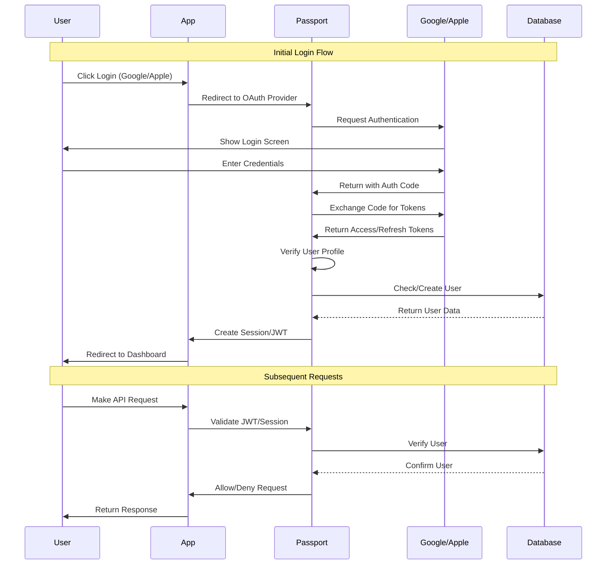

# Authentication Flow Documentation

## Overview
This document outlines the authentication flow implemented in our application using Passport.js. The system supports both Google OAuth and Apple Sign In authentication methods.

## Architecture Diagram



## Components

### 1. Passport Configuration (`src/config/passport.ts`)
```typescript
// Strategy Configuration
passport.use(new GoogleStrategy({...}));
passport.use(new AppleStrategy({...}));

// Session Management
passport.serializeUser((user, done) => {...});
passport.deserializeUser((user, done) => {...});
```

### 2. Express Middleware (`src/app.ts`)
```typescript
// Passport Initialization
app.use(passport.initialize());
app.use(passport.session());

// Auth Routes
app.use('/api/auth', authRoutes);
```

### 3. Authentication Routes (`src/routes/auth.routes.ts`)
```typescript
// OAuth Routes
router.get('/google', passport.authenticate('google'));
router.get('/apple', passport.authenticate('apple'));

// Callback Routes
router.get('/google/callback', passport.authenticate('google', {...}));
router.get('/apple/callback', passport.authenticate('apple', {...}));
```

## Authentication Flow

### 1. Initial Login Process
1. User initiates login by clicking the login button
2. Application redirects to the selected OAuth provider (Google/Apple)
3. Provider displays their authentication screen
4. User enters credentials on the provider's page
5. Provider redirects back to our application with an authorization code

### 2. Token Exchange and User Creation
1. Passport receives the authorization code
2. Exchanges the code for access and refresh tokens
3. Retrieves the user's profile from the provider
4. Checks if the user exists in our database
5. Creates or updates user record if necessary
6. Generates a session or JWT for the user

### 3. Session Management
1. Passport serializes the user object for session storage
2. Stores the session in the database or cookie
3. Deserializes the user on subsequent requests
4. Maintains user state across requests

### 4. Protected Route Access
1. Authentication middleware intercepts requests
2. Validates the JWT or session
3. Checks user permissions
4. Allows or denies access to protected routes

### 5. Error Handling
The system handles various error scenarios:
- Invalid or expired tokens
- Missing or invalid sessions
- Insufficient permissions
- Provider authentication failures
- Network errors during OAuth flow

## Security Considerations

1. **Token Security**
   - Access tokens are short-lived
   - Refresh tokens are securely stored
   - JWT signing uses environment variables

2. **Session Security**
   - Sessions are stored securely
   - Session IDs are cryptographically secure
   - Regular session cleanup

3. **OAuth Security**
   - State parameter validation
   - PKCE implementation for mobile
   - Secure callback URLs

## Environment Variables

Required environment variables for authentication:
```env
# Google OAuth
GOOGLE_CLIENT_ID=your_google_client_id
GOOGLE_CLIENT_SECRET=your_google_client_secret

# Apple Sign In
APPLE_CLIENT_ID=your_apple_client_id
APPLE_TEAM_ID=your_apple_team_id
APPLE_KEY_ID=your_apple_key_id
APPLE_PRIVATE_KEY_PATH=path_to_private_key
```

## Testing

The authentication system includes comprehensive tests:
- OAuth flow testing
- Session management testing
- Error handling testing
- Protected route testing

Run tests using:
```bash
npm run test:auth
```

## Troubleshooting

Common issues and solutions:
1. **Invalid OAuth Credentials**
   - Verify environment variables
   - Check callback URLs in provider console
   - Ensure proper scopes are configured

2. **Session Issues**
   - Check session storage configuration
   - Verify cookie settings
   - Check session middleware order

3. **Token Validation Failures**
   - Verify JWT secret
   - Check token expiration
   - Validate token format 