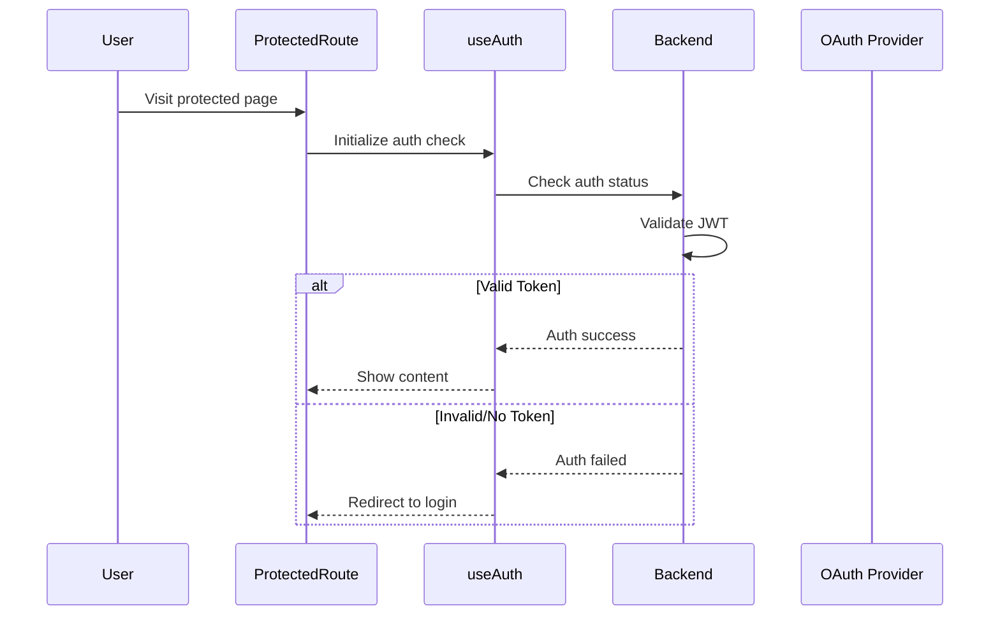
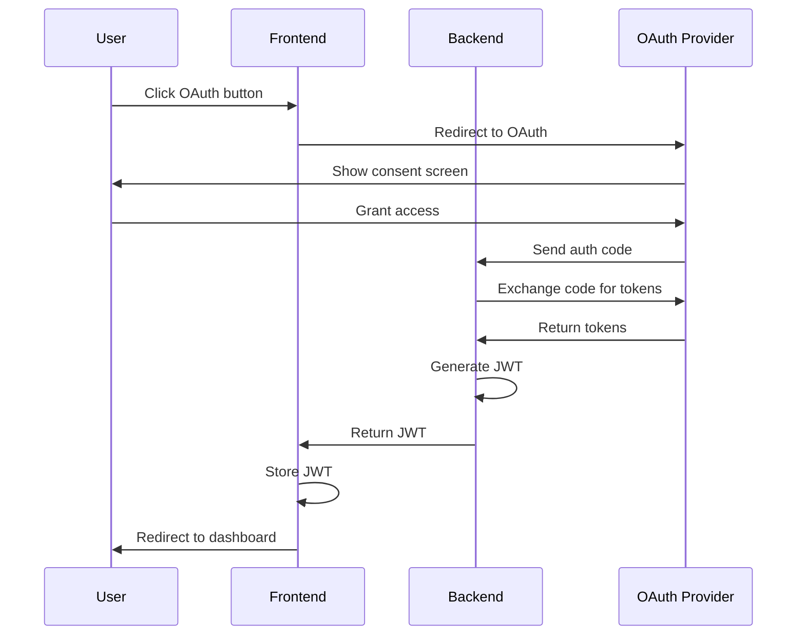

# Authentication Flow

This document describes the authentication flow in the Workout AI Trainer application, including both frontend and backend components.

## Overview

The application uses a combination of OAuth (Google and Apple Sign In) and JWT-based authentication to protect routes and manage user sessions. The flow is designed to be secure, user-friendly, and maintainable.

## Components

### Frontend Components

1. **ProtectedRoute Component**
   - Wraps protected pages
   - Handles authentication state
   - Manages loading and error states
   - Controls redirects based on auth status

2. **useAuth Hook**
   - Manages authentication state
   - Handles API calls to verify auth status
   - Provides loading and error states
   - Manages component lifecycle

### Backend Components

1. **Authentication Middleware**
   - `authenticateJWT`: Validates JWT tokens
   - `validateSession`: Ensures session is valid
   - `tokenRefreshMiddleware`: Handles token refresh

2. **OAuth Strategies**
   - Google OAuth
   - Apple Sign In

## Flow Diagrams

### Initial Page Load


### OAuth Login Flow


## Detailed Flow Description

### 1. Protected Route Access

When a user visits a protected route:

1. **Initial State**
   - `ProtectedRoute` component mounts
   - `useAuth` hook initializes
   - Loading state displayed

2. **Authentication Check**
   - Hook calls `checkAuthStatus()`
   - Backend validates JWT token
   - Token refresh if needed

3. **Outcome Handling**
   - Success: Display protected content
   - Failure: Redirect to login
   - Error: Show error message

### 2. OAuth Authentication

When a user initiates OAuth login:

1. **Initial Request**
   - User clicks OAuth button
   - Frontend redirects to provider
   - Provider shows consent screen

2. **Token Exchange**
   - Provider returns auth code
   - Backend exchanges code for tokens
   - JWT generated and stored

3. **Session Establishment**
   - Frontend stores JWT
   - User redirected to dashboard
   - Protected routes now accessible

### 3. Token Management

The system handles tokens through:

1. **JWT Validation**
   - Token signature verification
   - Expiration checking
   - Provider validation

2. **Token Refresh**
   - Automatic refresh before expiry
   - Transparent to user
   - Maintains session continuity

3. **Error Handling**
   - Invalid token detection
   - Refresh token management
   - Graceful error recovery

## Security Considerations

1. **Token Security**
   - JWT stored securely
   - HTTPS required
   - Token rotation implemented

2. **Session Management**
   - Secure session storage
   - CSRF protection
   - Rate limiting

3. **Error Handling**
   - Secure error messages
   - Logging of auth failures
   - Automatic session cleanup

## Implementation Notes

1. **Frontend**
   - Uses React hooks for state management
   - Implements proper loading states
   - Handles network errors gracefully

2. **Backend**
   - Middleware-based authentication
   - Secure token validation
   - Efficient session management

3. **Testing**
   - Comprehensive test coverage
   - Mock OAuth responses
   - Error scenario testing

## Environment Setup

Required environment variables:

```env
# OAuth Configuration
GOOGLE_CLIENT_ID=your-google-client-id
GOOGLE_CLIENT_SECRET=your-google-client-secret
APPLE_CLIENT_ID=your-apple-client-id
APPLE_TEAM_ID=your-apple-team-id
APPLE_KEY_ID=your-apple-key-id

# JWT Configuration
JWT_SECRET=your-jwt-secret
JWT_EXPIRES_IN=7d

# Session Configuration
SESSION_SECRET=your-session-secret
```

## Best Practices

1. **Code Organization**
   - Separation of concerns
   - Modular components
   - Clear error handling

2. **Security**
   - Regular token rotation
   - Secure storage
   - Input validation

3. **User Experience**
   - Clear loading states
   - Helpful error messages
   - Smooth transitions 