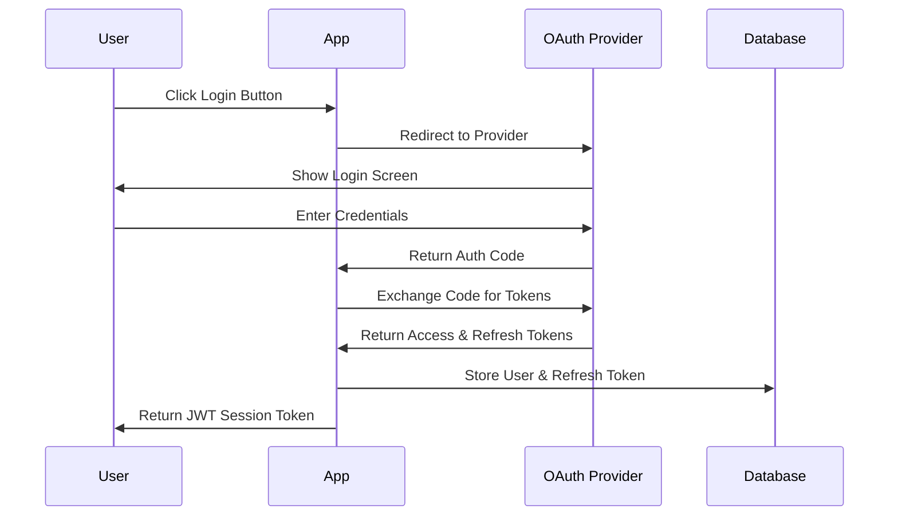
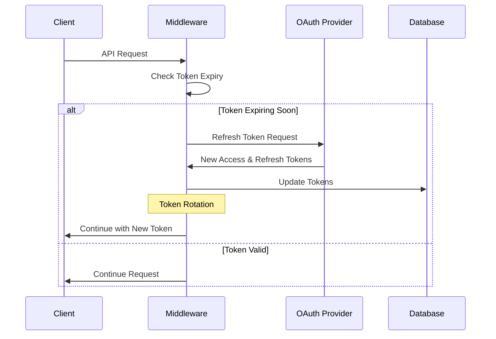

# Authentication System Documentation

## Overview

This document outlines our authentication system, which exclusively uses OAuth providers (Google and Apple) for user authentication. We've made a deliberate choice to avoid local username/password authentication to enhance security and user experience.

## Why OAuth-Only Authentication?

### Security Benefits
1. **No Password Storage**: We don't store or manage user passwords, eliminating the risk of password breaches
2. **Enterprise-Grade Security**: Leveraging Google and Apple's security infrastructure
3. **Two-Factor Authentication**: Automatically supported through providers
4. **Account Recovery**: Handled by providers' robust systems

### User Experience Benefits
1. **Simplified Login**: One-click authentication
2. **Familiar Process**: Users trust and understand Google/Apple login
3. **Cross-Device Access**: Easy authentication across devices
4. **Automatic Profile Information**: Get verified email and basic profile data

## Authentication Flow



## Token Management

### Types of Tokens
1. **Access Token**
   - Short-lived (typically 1 hour)
   - Used for API requests
   - Automatically refreshed when expired

2. **Refresh Token**
   - Long-lived
   - Used to obtain new access tokens
   - Rotated for security
   - Securely stored in database

3. **Session Token (JWT)**
   - Used for client-server communication
   - Contains user identification
   - Stateless authentication

### Token Refresh Process



### Token Rotation
- Refresh tokens are rotated (replaced) with each use
- Old refresh tokens are invalidated
- Enhances security by limiting token lifetime
- Prevents replay attacks

## Implementation Details

### Middleware
```typescript
// Token refresh middleware automatically handles:
1. Token expiration checking
2. Token refresh when needed
3. Token rotation
4. Database updates
```

### Security Measures
1. Refresh tokens stored with `select: false`
2. Token expiry tracked in database
3. Automatic token rotation
4. Secure error handling

### Error Handling
1. Failed refreshes don't break the application
2. Graceful degradation on provider issues
3. Detailed logging for debugging
4. Automatic retry on next request

## Development and Testing

### Enable Debug Logging
```bash
# All OAuth debugging
DEBUG=oauth:* npm run dev

# Specific components
DEBUG=oauth:google npm run dev
DEBUG=oauth:apple npm run dev
DEBUG=oauth:token npm run dev
```

### Running Tests
```bash
# Test OAuth flows
npm run test:oauth

# Test with server
npm run test:oauth-with-server
```

## Future Security Enhancements (Pre-MVP)

### TODO List - Critical Security Items
1. **Token Security**
   - Implement token blacklisting for revoked refresh tokens
   - Add rate limiting for token refresh attempts
   - Implement token revocation on suspicious activity
   - Add refresh token expiration (long-term but not infinite)
   - Implement Redis-based token blacklist for performance
   - Add token cleanup and maintenance routines

2. **Activity Monitoring**
   - Track login attempts and locations
   - Monitor refresh token usage patterns
   - Detect and alert on suspicious IP changes
   - Implement device fingerprinting
   - Add automated suspicious activity detection
   - Implement IP-based location change monitoring
   - Set up real-time security alerts for suspicious patterns

3. **Access Control**
   - Implement role-based access control (RBAC)
   - Add IP-based access restrictions for sensitive operations
   - Create admin dashboard for user management
   - Add session management and forced logout capability
   - Implement rate limiting on all authentication endpoints
   - Add distributed rate limiting for scalability

4. **Audit & Compliance**
   - Add comprehensive security audit logging
   - Implement GDPR compliance measures
   - Create data retention and deletion policies
   - Add user consent management
   - Set up structured security event logging
   - Implement automated log rotation and retention
   - Add Sentry integration for error tracking

5. **Infrastructure Security**
   - Set up rate limiting on all auth endpoints
   - Implement CORS policy refinement
   - Add API key rotation mechanism
   - Set up automated security headers updates
   - Add Redis infrastructure for performance optimization
   - Implement distributed security measures

6. **Provider-Specific Enhancements**
   - Implement Apple's ASWebAuthenticationSession flow
   - Add Google's Advanced Protection Program support
   - Support multiple OAuth providers per user
   - Add provider-specific security best practices

7. **Error Handling & Logging**
   - Enhance error logging for security events
   - Implement automated error reporting
   - Add security incident response workflow
   - Create security event alerting system
   - Set up centralized security logging
   - Add detailed activity monitoring and analytics

8. **Testing & Validation**
   - Add security penetration testing
   - Implement automated security scanning
   - Add token security validation tests
   - Create OAuth flow stress tests
   - Add rate limiting tests
   - Implement security monitoring tests

### Priority Matrix
```
High Priority (Sprint 1-2)
- Token blacklisting with Redis
- Rate limiting implementation
- Basic activity monitoring
- Error logging enhancement
- Security event logging setup

Medium Priority (Sprint 3-4)
- RBAC implementation
- Audit logging
- Provider-specific security
- Security headers
- Suspicious activity detection
- Distributed rate limiting

Lower Priority (Post-MVP)
- Advanced monitoring
- Complex analytics
- Additional OAuth providers
- Advanced compliance measures
- Automated security scanning
- Extended penetration testing
```

## Configuration

Required environment variables:
```env
# Google OAuth
GOOGLE_CLIENT_ID=your_google_client_id
GOOGLE_CLIENT_SECRET=your_google_client_secret

# Apple Sign In
APPLE_CLIENT_ID=your_apple_client_id
APPLE_TEAM_ID=your_apple_team_id
APPLE_KEY_ID=your_apple_key_id
APPLE_PRIVATE_KEY=your_apple_private_key
```

## Security Implementation Examples

### 1. Token Blacklisting
Prevents use of revoked or suspicious tokens:

```typescript
// In src/services/token-blacklist.service.ts
interface BlacklistedToken {
    token: string;
    reason: 'revoked' | 'suspicious' | 'logout';
    timestamp: Date;
    userId: string;
}

export class TokenBlacklistService {
    // Use Redis or similar for performance
    private static async isBlacklisted(token: string): Promise<boolean> {
        const blacklistedToken = await blacklistCollection.findOne({ token });
        return !!blacklistedToken;
    }

    // Add to blacklist when user logs out or suspicious activity detected
    private static async addToBlacklist(token: string, userId: string, reason: BlacklistedToken['reason']): Promise<void> {
        await blacklistCollection.insertOne({
            token,
            userId,
            reason,
            timestamp: new Date()
        });
    }
}

// In token-refresh.middleware.ts
export async function tokenRefreshMiddleware(req: Request, res: Response, next: NextFunction) {
    try {
        // Check blacklist before processing
        if (await TokenBlacklistService.isBlacklisted(req.user?.refreshToken)) {
            return res.status(401).json({ message: 'Token has been revoked' });
        }
        // ... existing middleware code
    } catch (error) {
        next(error);
    }
}
```

### 2. Rate Limiting
Protects against brute force and DoS attempts:

```typescript
// In src/middleware/rate-limit.middleware.ts
import rateLimit from 'express-rate-limit';

export const authRateLimiter = rateLimit({
    windowMs: 15 * 60 * 1000, // 15 minutes
    max: 5, // 5 attempts per window
    message: 'Too many authentication attempts, please try again later',
    standardHeaders: true,
    legacyHeaders: false,
    keyGenerator: (req) => {
        // Use combination of IP and user ID if available
        return req.user?.id 
            ? `${req.ip}-${req.user.id}`
            : req.ip;
    }
});

// Apply to specific routes
app.use('/auth/token/refresh', authRateLimiter);
```

### 3. Activity Monitoring
Tracks and analyzes authentication events:

```typescript
// In src/services/activity-monitor.service.ts
interface AuthActivity {
    userId: string;
    action: 'login' | 'token_refresh' | 'logout';
    ip: string;
    userAgent: string;
    timestamp: Date;
    status: 'success' | 'failure';
    details?: Record<string, any>;
}

export class ActivityMonitorService {
    static async logActivity(activity: Omit<AuthActivity, 'timestamp'>): Promise<void> {
        await activityCollection.insertOne({
            ...activity,
            timestamp: new Date()
        });

        // Check for suspicious patterns
        await this.checkForSuspiciousActivity(activity.userId);
    }

    private static async checkForSuspiciousActivity(userId: string): Promise<void> {
        const recentActivities = await activityCollection
            .find({ 
                userId,
                timestamp: { $gte: new Date(Date.now() - 24 * 60 * 60 * 1000) }
            })
            .toArray();

        // Example checks:
        // 1. Multiple failed attempts
        const failedAttempts = recentActivities.filter(a => a.status === 'failure');
        if (failedAttempts.length >= 5) {
            await this.flagSuspiciousActivity(userId, 'multiple_failures');
        }

        // 2. Rapid location changes
        const uniqueIPs = new Set(recentActivities.map(a => a.ip));
        if (uniqueIPs.size > 3) {
            await this.flagSuspiciousActivity(userId, 'multiple_locations');
        }
    }
}

// Usage in auth controller
googleCallback: async (req: Request, res: Response) => {
    try {
        // ... existing code ...

        await ActivityMonitorService.logActivity({
            userId: user.id,
            action: 'login',
            ip: req.ip,
            userAgent: req.headers['user-agent'] || 'unknown',
            status: 'success'
        });

        // ... rest of the code ...
    } catch (error) {
        await ActivityMonitorService.logActivity({
            userId: user?.id,
            action: 'login',
            ip: req.ip,
            userAgent: req.headers['user-agent'] || 'unknown',
            status: 'failure',
            details: { error: error.message }
        });
        throw error;
    }
}
```

### 4. Enhanced Security Logging
Comprehensive logging for security events:

```typescript
// In src/utils/logger.ts
import debug from 'debug';
import { captureException } from '@sentry/node'; // or similar error tracking service

const authLogger = debug('auth:security');

export interface SecurityLog {
    level: 'info' | 'warn' | 'error';
    event: string;
    userId?: string;
    context: Record<string, any>;
    timestamp: Date;
}

export class SecurityLogger {
    static async log(data: Omit<SecurityLog, 'timestamp'>): Promise<void> {
        const logEntry = {
            ...data,
            timestamp: new Date()
        };

        // Console logging
        authLogger('%O', logEntry);

        // Persistent storage
        await securityLogsCollection.insertOne(logEntry);

        // Error tracking for serious issues
        if (data.level === 'error') {
            captureException(new Error(data.event), {
                extra: data.context
            });
        }
    }
}
```

### Implementation Notes

1. **Token Blacklisting**
   - Consider using Redis for better performance
   - Implement cleanup of old blacklist entries
   - Add metrics for blacklist size and usage

2. **Rate Limiting**
   - Adjust limits based on endpoint sensitivity
   - Consider using distributed rate limiting for scale
   - Add monitoring for rate limit hits

3. **Activity Monitoring**
   - Balance data collection with privacy
   - Consider data retention policies
   - Add automated alerts for suspicious patterns

4. **Security Logging**
   - Implement log rotation
   - Consider GDPR compliance for logging
   - Set up automated log analysis

### Dependencies Required
```json
{
  "dependencies": {
    "express-rate-limit": "^6.0.0",
    "redis": "^4.0.0",
    "@sentry/node": "^7.0.0",
    "debug": "^4.0.0"
  }
}
``` 