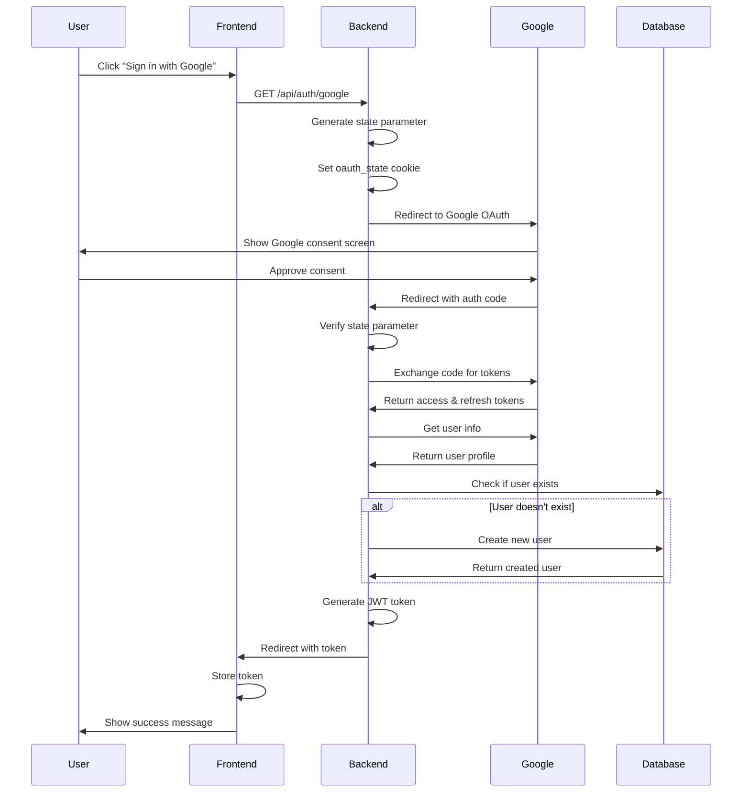

# Registration Flow Documentation

This document describes the complete registration flow for the Workout AI Trainer application, including both OAuth authentication and fitness profile collection.

## Overview

The registration process consists of two main phases:
1. OAuth Authentication (Google or Apple)
2. Fitness Profile Collection

## OAuth Authentication Flow

### Google OAuth Flow


### Apple Sign In Flow


## Fitness Profile Collection

After successful OAuth authentication, the user is prompted to complete their fitness profile:


## Data Structures

### User Data
```typescript
interface BaseUser {
    userId: string;                   // Unique user identifier
    providerId: string;               // OAuth provider ID
    provider: "google" | "apple";     // OAuth provider type
    email: string;
    emailVerified: boolean;
    firstName?: string;
    lastName?: string;
    displayName?: string;
    profilePicture?: string;
    accountStatus?: "active" | "disabled";
    refreshToken?: string;
    tokenExpiresAt?: Date;
    isRegistrationComplete?: boolean;
    createdAt: Date;
    updatedAt: Date;
}
```

### Fitness Profile Data
```typescript
interface FitnessProfile {
    userId: string;
    ageRange?: "18-24" | "25-34" | "35-44" | "45-54" | "55+";
    sex?: "male" | "female" | "other";
    fitnessLevel: "beginner" | "intermediate" | "advanced";
    goals: Array<"weight loss" | "muscle gain" | "strength" | "endurance" | "power" | "flexibility" | "general fitness">;
    injuriesOrLimitations?: string[];
    availableEquipment: string[];
    preferredTrainingDays?: Array<"Monday" | "Tuesday" | "Wednesday" | "Thursday" | "Friday" | "Saturday" | "Sunday">;
    preferredWorkoutDuration?: "short" | "medium" | "long";
    locationPreference?: "gym" | "home" | "park" | "indoor" | "outdoor" | "both";
    createdAt: Date;
    updatedAt: Date;
}
```

## Security Measures

1. **OAuth Security**:
   - State parameter to prevent CSRF attacks
   - Secure cookie settings
   - JWT token generation for subsequent requests
   - Email verification status tracking

2. **Data Validation**:
   - All required fields must be present
   - Goals must be from predefined list
   - Fitness level must be one of three options
   - Training days must be valid days of the week
   - Workout duration must be one of three options
   - Location preference must be from predefined list

3. **Database Security**:
   - One-to-one relationship between User and FitnessProfile
   - Unique index on `userId` in fitness_profiles collection
   - Both collections are created during initial database setup

## Error Handling

The registration flow includes comprehensive error handling for:

1. **OAuth Errors**:
   - Invalid state parameter
   - Missing authorization code
   - Token exchange failures
   - Network issues

2. **Profile Collection Errors**:
   - Missing required fields
   - Invalid field values
   - Database errors
   - Network issues

## Post-Registration

After successful registration:

1. User can update their fitness profile at any time
2. Profile data is used to generate personalized workouts
3. User preferences are considered when creating workout plans
4. Progress can be tracked and workouts can be adjusted based on feedback 